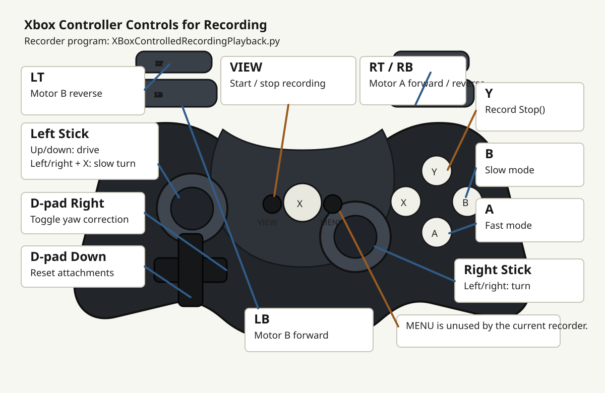

# FLLRoboSpartans

Pybricks programs for recording LEGO SPIKE Prime robot driving with an Xbox controller and turning the recording into a readable mission program.

## Programs

- [XBoxControlledRecordingPlayback.py](XBoxControlledRecordingPlayback.py): drive the robot with an Xbox controller and print generated mission commands to the console.
- [MissionRunner.py](MissionRunner.py): paste generated commands into this file, upload it to a Pybricks hub slot, and run it from the hub.

## Pybricks Hub Slot Limit

Pybricks firmware gives the hub **5 program slots**. The square-style slot selector on the hub is normal for Pybricks.

That means you can keep up to 5 uploaded Pybricks programs on the hub at one time. To put a mission into a specific slot, select that slot in Pybricks Code before downloading/uploading [MissionRunner.py](MissionRunner.py).

The LEGO/SPIKE numbered slot UI is a different firmware/app workflow. These programs use Pybricks APIs, including `XboxController`, so they run under Pybricks firmware.

## Xbox Controller Map



Supported controls in [XBoxControlledRecordingPlayback.py](XBoxControlledRecordingPlayback.py):

- `VIEW`: start or stop recording.
- Left stick up/down: drive forward or backward.
- Right stick left/right: turn.
- Hold `X` and move left stick left/right: slower precision turn.
- `Y`: record `Stop()` and brake/hold the drive motors.
- D-pad right: toggle yaw correction and print `ToggleYawCorrection(True/False)` while recording.
- D-pad down: reset both attachments to their starting angles.
- `A`: fast mode, 2x drive/turn/attachment speed while held.
- `B`: slow mode, 0.4x drive/turn/attachment speed while held.
- Right trigger: move attachment motor A forward.
- `RB`: move attachment motor A reverse.
- `LB`: move attachment motor B forward.
- Left trigger: move attachment motor B reverse.
- `MENU`: unused by the current recorder.

## Recording A Mission

1. Upload and run [XBoxControlledRecordingPlayback.py](XBoxControlledRecordingPlayback.py) from Pybricks Code.
2. Turn on the Xbox controller and pair/connect it to the hub.
3. Wait for calibration to finish and for the console to print:

```text
>>> System Ready. Waiting for input...
```

4. Press Xbox `VIEW` to start recording.
5. Drive the mission with the controller.
6. Press Xbox `VIEW` again to stop recording.
7. Copy the generated commands printed between:

```python
# --- GENERATED PYTHON SCRIPT ---
# ----------------------------------------------------
```

The recorder does not save the mission in memory. It only prints readable commands to the console, such as:

```python
Drive(250, 50)
Rotate(150, 90)
LeftAttachmentRotate(60, 120)
Stop()
```

## Playing Back A Mission

1. Open [MissionRunner.py](MissionRunner.py).
2. Paste the generated commands inside `run_recording()`:

```python
def run_recording():
	# --- PASTE RECORDING BELOW THIS LINE ---
	Drive(250, 50)
	Rotate(150, 90)
	LeftAttachmentRotate(60, 120)
	# ---------------------------------------
	Stop()
```

3. In Pybricks Code, select the hub slot you want to use.
4. Download/upload [MissionRunner.py](MissionRunner.py) to that selected slot.
5. On the hub, use the Pybricks slot selector to choose that slot.
6. Press the hub center button to run the mission.

## MissionRunner Commands

[MissionRunner.py](MissionRunner.py) contains all helper functions needed by the generated commands:

- `Drive(speed, distance_cm)`: drive straight for a distance in centimeters.
- `Rotate(speed, angle_deg)`: gyro-controlled turn by degrees.
- `LeftAttachmentRotate(speed, angle_deg)`: rotate attachment motor A.
- `RightAttachmentRotate(speed, angle_deg)`: rotate attachment motor B.
- `ToggleYawCorrection(state)`: enable or disable DriveBase yaw correction.
- `Stop()`: stop/hold the drive motors and stop attachment motors.

## Tips For Better Recordings

- For a pure turn, use the right stick left/right and avoid pushing the drive stick forward/backward at the same time.
- Return sticks to neutral briefly between separate actions so the recorder can split commands cleanly.
- Use `Y` when you want an explicit `Stop()` in the generated mission.
- Record a short test first, paste it into [MissionRunner.py](MissionRunner.py), and verify it before recording a full mission.
