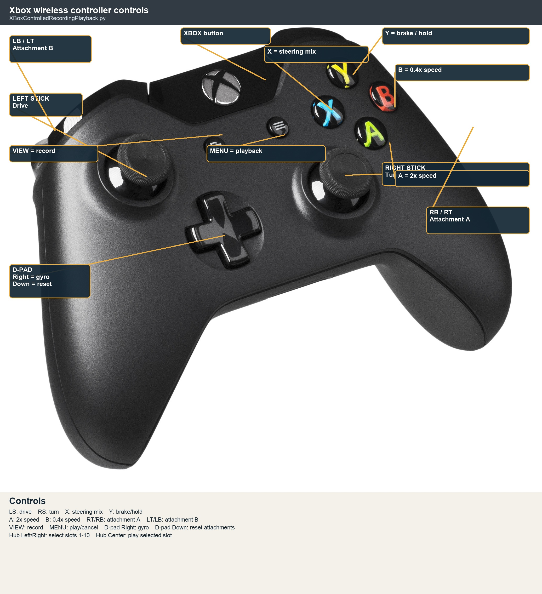

# FLLRoboSpartans
 FLL code

## Xbox Recording and Playback

Run `XBoxControlledRecordingPlayback.py` on the PrimeHub to drive the robot manually, record a movement sequence, replay it, and generate autonomous Python commands.
4. The hub display shows the currently selected recording slot. Ten persistent slots are available, numbered 1 through 10.

*Rendered from a photograph by Evan-Amos, public domain, via [Wikimedia Commons](https://commons.wikimedia.org/wiki/File:Microsoft-Xbox-One-controller.jpg).*

### Before driving

1. Download and run `XBoxControlledRecordingPlayback.py` on the hub.
2. Keep the robot still during gyro calibration.
3. Connect the Xbox controller. The hub light is red while connecting, green when connected, and blue when the program is running without a controller.
4. Press View again to stop recording. The movement data is saved to the selected hub slot and the generated autonomous commands are printed to the controller terminal.

### Record a program
Recordings are stored in the PrimeHub's persistent storage and loaded when the program starts. They survive a program restart and normal hub shutdown, but are cleared by a Pybricks firmware update. The ten slots share space for up to 99 autonomous commands such as drive, rotate, attachment, gyro, and stop commands. A recording that exceeds the remaining shared capacity is not saved and reports how many commands fit. The generated commands must be copied into `MissionRunner.py` for longer or permanent autonomous missions.
1. Use the hub's Left and Right buttons to select the destination slot.
2. Press the controller's View button to start recording. The hub displays `R`.
3. Drive the robot and operate the attachments using the controls below.
4. Press View again to stop recording. The movement data is saved to the selected slot and the generated autonomous commands are printed to the controller terminal.
5. Copy the generated commands into the matching `run_slot_N()` function in `MissionRunner.py` when you want the sequence to become a fixed autonomous mission.

Turn the hub off normally after saving so Pybricks can commit the recordings to flash. Removing the battery while the hub is running can lose newly saved data.

### Play a recorded slot

1. Select the slot with the hub's Left and Right buttons.
2. Press the controller's Menu button or the hub's Center button.
3. The hub displays `P` while playback is running.
4. Press the same playback button again to cancel. Playback also stops automatically when the recording finishes.

No Xbox controller is required to select and replay recordings that are already saved. Press the hub's Bluetooth button to stop the program; Center is reserved for playback.

### Controller controls

| Control | Function |
| --- | --- |
| Left stick up/down | Drive forward/backward. A deadzone and progressive speed curve are applied. |
| Right stick left/right | Turn left/right. |
| X held | Add left-stick horizontal steering to the turn command. |
| Right trigger (RT) | Run attachment motor A forward. |
| Left trigger (LT) | Run attachment motor B in reverse. |
| RB held | Run attachment motor A in reverse. |
| LB held | Run attachment motor B forward. |
| A held | Use the 2x speed multiplier. |
| B held | Use the 0.4x speed multiplier. |
| Y pressed/held | Print a `Stop()` command and actively hold the drive motors. |
| D-pad Right | Toggle gyro yaw correction. A high beep means enabled; a low beep means disabled. |
| D-pad Down | Return both attachment motors to their positions at the start of the recording. |
| View | Start or stop recording. |
| Menu | Start or cancel playback of the selected slot. |

### Hub controls

| Hub button | Function |
| --- | --- |
| Left | Select the previous virtual recording slot. |
| Right | Select the next virtual recording slot. Selection wraps between slots 1 and 10. |
| Center | Start or cancel playback of the selected virtual slot. |
| Bluetooth | Stop the program. |

When an attachment motor stalls, the controller rumbles. During playback, A and B can still apply the speed multiplier to the replayed movement.

Available functions in the common library:

setupMotors()
resetYaw()
degreesForDistance(distance_cm)
drive(distance, speed)
rotateRightArm(degrees, speed)
rotateLeftArm(degrees, speed)
rotateCenterArm(degrees, speed)
resetArmRotation()
turn_done()
rotateDegrees(degrees, speed)
spin_turn(robot_degrees, motor_speed)
pivot_turn(robot_degrees, motor_speed)
all_done()
beep(frequency, duration)

## Forward SSH Agent

eval "$(ssh-agent -s)"
ssh-add ~/.ssh/id_github
